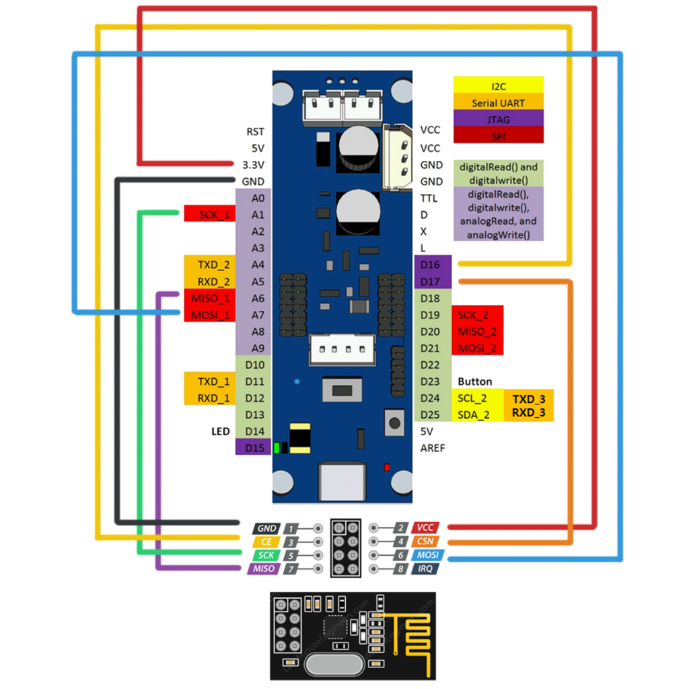

# OpenCM9.04 + nRF24L01 + Dynamixel Control (Reference Implementation)

> ⚠️ IMPORTANT:  
> This project is NOT polished production code.  
> It is a simple reference / experimental implementation for testing and learning purposes.

---

## Overview

This project demonstrates basic wireless control of two Dynamixel servos using:

- OpenCM9.04 (with EXP board)
- nRF24L01 2.4GHz transceiver module
- Dynamixel2Arduino library
- RF24 library

The system:
1. Receives joystick-style data (`throttle`, `pitch`, `roll`, `yaw`) over RF.
2. Uses the `roll` channel to increment/decrement two Dynamixel servos.
3. Constrains servo motion within defined angle limits.

This is a simple incremental position control example.

---

## Hardware Requirements

- 1x OpenCM9.04
- 2x Dynamixel servos (Protocol 1.0 compatible)
- 1x nRF24L01 module
- External power supply for servos (recommended)
- Jumper wires

---

## Wiring

### nRF24L01 → OpenCM9.04

| nRF24L01 | OpenCM9.04 |
|----------|------------|
| VCC      | 3.3V       |
| GND      | GND        |
| CE       | 16         |
| CSN      | 17         |
| SCK      | A1         |
| MOSI     | A7         |
| MISO     | A6         |

> ⚠️ Use a stable 3.3V power source for the nRF24L01.  
> Add a decoupling capacitor if communication becomes unstable.

---

### Dynamixel Servos

- Connected to DXL port on OpenCM9.04 EXP board
- Direction pin: 28
- Baudrate: 1000000
- Protocol Version: 1.0
- Servo IDs:
  - ID 1
  - ID 2

---

## Wiring Diagram

Place your wiring image in the repository and reference it like this:

```markdown

```

Or if inside a folder:

```markdown

```

---

## Software Behavior

### Initialization

- Sets baudrate to 1,000,000 bps
- Sets protocol version to 1.0
- Pings both servos
- Sets operating mode to OP_POSITION
- Enables torque
- Sets moving speed to 50
- Moves servos to initial positions:
  - Servo 1 → 115°
  - Servo 2 → 25°

---

### Control Logic

Each loop:

1. Checks for incoming RF data.
2. Maps `roll` (0–255) to:
   - Servo 1 increment: -10° to +10°
   - Servo 2 increment: +10° to -10°
3. Reads present position.
4. Applies constrained incremental update:
   - Servo 1 range: 45°–115°
   - Servo 2 range: 25°–95°
5. Sends new goal position.

This creates mirrored motion between the two servos.

---

## Data Structure

```cpp
struct Data_Package {
  byte throttle;
  byte pitch;
  byte roll;
  byte yaw;
};
```

Currently only `roll` is used for motion control.

---

## Limitations

- No failsafe timeout handling (timestamp exists but not used)
- No communication validation
- No filtering or smoothing
- No acceleration control
- No structured architecture
- No advanced error handling

This is intentionally minimal for clarity and experimentation.

---

## Possible Improvements

- Add RF timeout failsafe
- Add motion smoothing
- Add acceleration limiting
- Implement PID-based position control
- Add error reporting
- Improve overall software structure

---

## License

Free to use for educational and experimental purposes.
